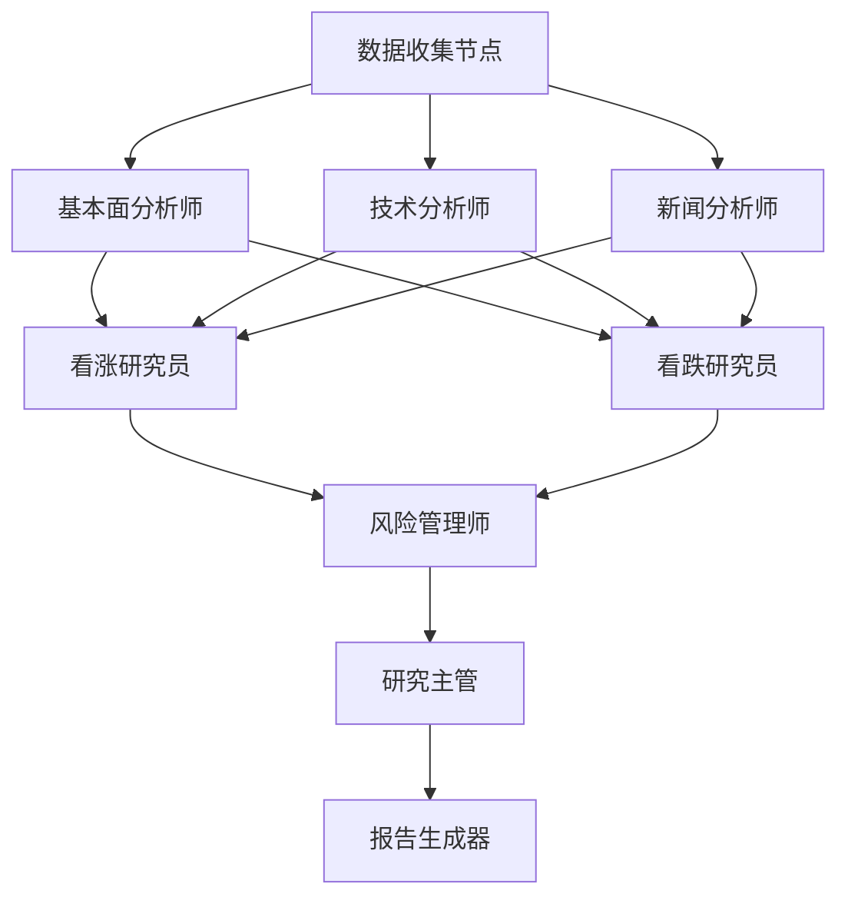

# 🔧 Analysis Engine 工具链和图架构设计

## 📍 **架构概述**

Analysis Engine Service 负责实现股票分析的核心业务逻辑，包括工具链管理、分析图编排和多智能体协作。

### **🏗️ 服务分工**

```
┌─────────────────┐    ┌─────────────────┐    ┌─────────────────┐
│   LLM Service   │    │ Analysis Engine │    │  Data Service   │
│                 │    │                 │    │                 │
│ • 模型适配器     │    │ • 工具链管理     │    │ • 数据获取       │
│ • 提示词管理     │◄──►│ • 分析图编排     │◄──►│ • 数据缓存       │
│ • 使用统计       │    │ • 智能体协作     │    │ • 数据清洗       │
│ • 成本跟踪       │    │ • 结果整合       │    │ • 数据验证       │
└─────────────────┘    └─────────────────┘    └─────────────────┘
```

## 🛠️ **工具链架构**

### **工具链管理器 (ToolkitManager)**

```python
class ToolkitManager:
    """统一管理所有分析工具"""
    
    def __init__(self):
        self.tools: Dict[str, ToolInfo] = {}
        self.data_tools: DataTools
        self.analysis_tools: AnalysisTools  
        self.news_tools: NewsTools
    
    async def call_tool(self, tool_name: str, parameters: Dict) -> Dict:
        """调用指定工具"""
```

### **工具分类**

#### **📊 数据工具 (DataTools)**
- `get_stock_data`: 获取股票基础数据
- `get_financial_data`: 获取财务数据
- `get_market_data`: 获取市场数据

#### **📈 分析工具 (AnalysisTools)**
- `calculate_technical_indicators`: 计算技术指标
- `perform_fundamental_analysis`: 执行基本面分析
- `calculate_valuation`: 计算估值

#### **📰 新闻工具 (NewsTools)**
- `get_stock_news`: 获取股票新闻
- `analyze_sentiment`: 分析情绪

### **工具调用示例**

```python
# 获取股票数据
result = await toolkit_manager.call_tool(
    "get_stock_data",
    {"symbol": "AAPL", "period": "1y"}
)

# 计算技术指标
result = await toolkit_manager.call_tool(
    "calculate_technical_indicators",
    {
        "data": {"prices": [150, 151, 149, 152]},
        "indicators": ["RSI", "MACD", "MA"]
    }
)
```

## 🔗 **分析图架构**

### **分析图 (AnalysisGraph)**

基于LangGraph实现的多智能体协作工作流：

```python
class AnalysisGraph:
    """分析图编排器"""
    
    async def execute_analysis(self, symbol: str, analysis_type: str):
        """执行分析流程"""
        
        if analysis_type == "comprehensive":
            return await self._execute_comprehensive_analysis(state)
        elif analysis_type == "debate":
            return await self._execute_debate_analysis(state)
```

### **图节点 (GraphNodes)**

#### **🔄 执行流程**



#### **📊 节点类型**

1. **数据收集节点**: 并行获取各种数据
2. **分析师节点**: 调用专业分析师智能体
3. **研究员节点**: 看涨/看跌观点辩论
4. **管理节点**: 风险管理和最终决策
5. **生成节点**: 报告格式化和输出

### **图状态管理**

```python
class GraphState(TypedDict):
    """分析图状态"""
    
    # 基本信息
    symbol: str
    company_name: str
    analysis_type: str
    
    # 数据
    stock_data: Optional[Dict]
    financial_data: Optional[Dict]
    market_data: Optional[Dict]
    
    # 分析结果
    fundamentals_report: Optional[str]
    technical_report: Optional[str]
    bull_analysis: Optional[str]
    bear_analysis: Optional[str]
    
    # 执行状态
    current_step: str
    completed_steps: List[str]
    errors: List[str]
```

## 🤖 **智能体工厂**

### **智能体工厂 (AgentFactory)**

```python
class AgentFactory:
    """智能体工厂"""
    
    def __init__(self, llm_service_url: str):
        self.llm_service_url = llm_service_url
        self.agents: Dict[str, BaseAgent] = {}
    
    async def call_agent(self, agent_type: str, **kwargs) -> Dict:
        """调用智能体"""
```

### **智能体类型**

| 智能体类型 | 任务类型 | 描述 |
|------------|----------|------|
| `fundamentals_analyst` | `fundamentals_analysis` | 基本面分析师 |
| `technical_analyst` | `technical_analysis` | 技术分析师 |
| `news_analyst` | `news_analysis` | 新闻分析师 |
| `bull_researcher` | `bull_analysis` | 看涨研究员 |
| `bear_researcher` | `bear_analysis` | 看跌研究员 |
| `risk_manager` | `risk_management` | 风险管理师 |
| `research_manager` | `research_management` | 研究主管 |

### **智能体调用流程**

```python
# 调用基本面分析师
result = await agent_factory.call_agent(
    agent_type="fundamentals_analyst",
    symbol="AAPL",
    company_name="苹果公司",
    financial_data=financial_data,
    current_date="2025-01-22"
)
```

## 🔄 **分析流程**

### **1. 基本面分析流程**

```python
async def _execute_fundamentals_analysis(self, state: GraphState):
    # 1. 数据收集
    state = await self.graph_nodes.data_collection_node(state)
    
    # 2. 基本面分析
    state = await self.graph_nodes.fundamentals_analyst_node(state)
    
    # 3. 风险评估
    state = await self.graph_nodes.risk_manager_node(state)
    
    # 4. 生成报告
    state = await self.graph_nodes.report_generator_node(state)
    
    return self._format_analysis_result(state)
```

### **2. 综合分析流程**

```python
async def _execute_comprehensive_analysis(self, state: GraphState):
    # 1. 数据收集
    state = await self.graph_nodes.data_collection_node(state)
    
    # 2. 并行分析
    analysis_tasks = [
        self.graph_nodes.fundamentals_analyst_node(state.copy()),
        self.graph_nodes.technical_analyst_node(state.copy()),
        self.graph_nodes.news_analyst_node(state.copy())
    ]
    
    results = await asyncio.gather(*analysis_tasks)
    
    # 3. 辩论阶段
    state = await self.graph_nodes.bull_researcher_node(state)
    state = await self.graph_nodes.bear_researcher_node(state)
    
    # 4. 最终决策
    state = await self.graph_nodes.research_manager_node(state)
    
    return self._format_analysis_result(state)
```

### **3. 辩论分析流程**

```python
async def _execute_debate_analysis(self, state: GraphState):
    # 多轮辩论
    for round_num in range(max_rounds):
        # 看涨观点
        state = await self.graph_nodes.bull_researcher_node(state)
        
        # 看跌观点  
        state = await self.graph_nodes.bear_researcher_node(state)
        
        # 检查共识
        if await self._check_consensus(state):
            break
    
    # 最终决策
    state = await self.graph_nodes.research_manager_node(state)
    
    return self._format_analysis_result(state)
```

## 📊 **API接口**

### **分析接口**

```http
POST /api/v1/analysis/stock
{
  "symbol": "AAPL",
  "analysis_type": "comprehensive",
  "parameters": {
    "enable_fundamentals": true,
    "enable_technical": true,
    "enable_debate": true,
    "model_name": "deepseek-chat"
  }
}
```

### **工具调用接口**

```http
POST /api/v1/tools/call
{
  "tool_name": "get_stock_data",
  "parameters": {
    "symbol": "AAPL",
    "period": "1y"
  }
}
```

### **管理接口**

```http
GET /api/v1/tools/list          # 获取工具列表
GET /api/v1/agents/list         # 获取智能体列表
GET /api/v1/graphs/status       # 获取图状态
POST /api/v1/admin/reload       # 重新加载组件
```

## 🧪 **测试验证**

### **运行测试**

```bash
# 测试图分析器
python backend/tests/unit/analysis-engine/test_graph_analyzer.py

# 测试工具链
python backend/tests/unit/analysis-engine/test_toolkit.py

# 测试智能体工厂
python backend/tests/unit/analysis-engine/test_agents.py
```

### **测试覆盖**

- ✅ 工具链初始化和调用
- ✅ 智能体工厂和调用
- ✅ 分析图执行流程
- ✅ 各种分析类型
- ✅ 错误处理和降级
- ✅ 资源清理

## 🚀 **部署配置**

### **环境变量**

```bash
# Analysis Engine配置
ANALYSIS_ENGINE_HOST=0.0.0.0
ANALYSIS_ENGINE_PORT=8005
ANALYSIS_ENGINE_DEBUG=false

# 依赖服务
LLM_SERVICE_URL=http://localhost:8004
DATA_SERVICE_URL=http://localhost:8003

# 分析配置
DEFAULT_ANALYSIS_TYPE=comprehensive
MAX_CONCURRENT_ANALYSES=5
ANALYSIS_TIMEOUT=300

# 工具配置
TOOL_CACHE_TTL=300
MAX_TOOL_RETRIES=3

# 智能体配置
DEFAULT_MODEL=deepseek-chat
DEFAULT_TEMPERATURE=0.1
DEFAULT_MAX_TOKENS=1500
```

### **Docker配置**

```dockerfile
FROM python:3.10-slim

WORKDIR /app
COPY requirements.txt .
RUN pip install -r requirements.txt

COPY . .

EXPOSE 8005
CMD ["python", "-m", "uvicorn", "app.main:app", "--host", "0.0.0.0", "--port", "8005"]
```

## 💡 **核心优势**

### **1. 模块化设计**
- 🔧 **工具链**: 独立的工具模块，易于扩展
- 🔗 **分析图**: 灵活的工作流编排
- 🤖 **智能体**: 专业的分析师角色

### **2. 高性能**
- ⚡ **并行处理**: 多个分析任务并行执行
- 📋 **智能缓存**: 数据和结果缓存
- 🔄 **异步架构**: 全异步处理

### **3. 可扩展性**
- 🛠️ **新工具**: 易于添加新的分析工具
- 🤖 **新智能体**: 支持新的分析师角色
- 📊 **新流程**: 灵活的分析流程定制

### **4. 可靠性**
- 🛡️ **错误处理**: 完善的异常处理机制
- 📉 **降级策略**: 服务不可用时的降级处理
- 🔄 **重试机制**: 自动重试失败的操作

这个工具链和图架构为Analysis Engine提供了强大的股票分析能力，实现了TradingAgents的多智能体协作模式！🎯
