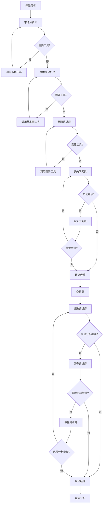

# Backend图架构设计文档

## 📋 **概述**

本文档详细说明了Backend项目中图架构的设计理念、实现方案和技术细节。Backend采用混合架构（微服务 + LangGraph），既保持了与TradingAgents功能的完全一致性，又获得了微服务架构的所有优势。

## 🎯 **设计目标**

### **核心目标**
1. **功能一致性**：与TradingAgents实现完全相同的多轮辩论功能
2. **架构优化**：利用微服务架构提升可扩展性和可靠性
3. **性能提升**：通过并发处理和原生Function Calling提升性能
4. **维护性**：清晰的服务边界和模块化设计

### **关键需求**
- ✅ 多轮投资辩论（多头vs空头）
- ✅ 三方风险分析（激进vs保守vs中性）
- ✅ 条件性工具调用循环
- ✅ 复杂状态管理和传递
- ✅ 动态路由和条件分支

## 🏗️ **架构设计**

### **混合架构模式**

```
Backend混合架构 = 微服务架构 + LangGraph图引擎

组件分层：
┌─────────────────────────────────────┐
│           API Gateway (8001)        │  ← 统一入口
├─────────────────────────────────────┤
│      Analysis Engine (8002)         │  ← 图引擎层
│         ├── TradingGraph            │
│         ├── ConditionalLogic        │
│         ├── GraphState              │
│         └── AgentNodes              │
├─────────────────────────────────────┤
│       Agent Service (8005)          │  ← 微服务层
│       LLM Service (8004)            │
│       Data Service (8003)           │
│       Memory Service (8006)         │
└─────────────────────────────────────┘
```

### **核心组件**

#### **1. TradingGraph - 主图引擎**
```python
class TradingGraph:
    """Backend交易图引擎"""
    
    def _build_graph(self) -> StateGraph:
        workflow = StateGraph(GraphState)
        
        # 分析师节点
        workflow.add_node("market_analyst", self.agent_nodes.market_analyst_node)
        workflow.add_node("fundamentals_analyst", self.agent_nodes.fundamentals_analyst_node)
        workflow.add_node("news_analyst", self.agent_nodes.news_analyst_node)
        
        # 研究员节点
        workflow.add_node("bull_researcher", self.agent_nodes.bull_researcher_node)
        workflow.add_node("bear_researcher", self.agent_nodes.bear_researcher_node)
        workflow.add_node("research_manager", self.agent_nodes.research_manager_node)
        
        # 风险分析节点
        workflow.add_node("risky_analyst", self.agent_nodes.risky_analyst_node)
        workflow.add_node("safe_analyst", self.agent_nodes.safe_analyst_node)
        workflow.add_node("neutral_analyst", self.agent_nodes.neutral_analyst_node)
        workflow.add_node("risk_manager", self.agent_nodes.risk_manager_node)
        
        # 条件边
        workflow.add_conditional_edges(
            "bull_researcher",
            self.conditional_logic.should_continue_debate,
            {
                "bear_researcher": "bear_researcher",
                "research_manager": "research_manager"
            }
        )
        
        return workflow
```

#### **2. ConditionalLogic - 条件逻辑处理**
```python
class ConditionalLogic:
    """Backend条件逻辑处理器"""
    
    def should_continue_debate(self, state: GraphState) -> str:
        """判断投资辩论是否继续"""
        if self.debate_state["count"] >= 2 * self.max_debate_rounds:
            return "research_manager"  # 结束辩论
        
        current_speaker = self.debate_state.get("current_speaker")
        if current_speaker == "bear":
            self.debate_state["current_speaker"] = "bull"
            return "bull_researcher"   # 轮到多头
        else:
            self.debate_state["current_speaker"] = "bear"
            return "bear_researcher"   # 轮到空头
    
    def should_continue_risk_analysis(self, state: GraphState) -> str:
        """判断风险分析是否继续"""
        if self.risk_state["count"] >= 3 * self.max_risk_rounds:
            return "risk_manager"      # 结束分析
        
        current_speaker = self.risk_state.get("current_speaker")
        if current_speaker == "neutral":
            self.risk_state["current_speaker"] = "risky"
            return "risky_analyst"     # 轮到激进
        elif current_speaker == "risky":
            self.risk_state["current_speaker"] = "safe"
            return "safe_analyst"      # 轮到保守
        else:
            self.risk_state["current_speaker"] = "neutral"
            return "neutral_analyst"   # 轮到中性
```

#### **3. GraphState - 图状态定义**
```python
class GraphState(TypedDict):
    """Backend图状态定义"""
    
    # 基本信息
    symbol: str
    company_name: str
    analysis_type: str
    current_date: str
    
    # 原始数据
    stock_data: Optional[Dict[str, Any]]
    financial_data: Optional[Dict[str, Any]]
    market_data: Optional[Dict[str, Any]]
    news_data: Optional[Dict[str, Any]]
    
    # 分析报告
    fundamentals_report: Optional[str]
    technical_report: Optional[str]
    news_report: Optional[str]
    sentiment_report: Optional[str]
    
    # 研究员观点
    bull_analysis: Optional[str]
    bear_analysis: Optional[str]
    
    # 风险管理
    risk_assessment: Optional[Dict[str, Any]]
    risky_analysis: Optional[str]
    safe_analysis: Optional[str]
    neutral_analysis: Optional[str]
    
    # 最终决策
    final_recommendation: Optional[Dict[str, Any]]
    investment_plan: Optional[str]
    
    # 辅助信息
    messages: List[Dict[str, Any]]
    errors: List[str]
    metadata: Dict[str, Any]
    
    # 执行状态
    current_step: str
    completed_steps: List[str]
    next_steps: List[str]
    
    # 辩论状态
    debate_history: List[Dict[str, Any]]
    debate_summary: Optional[Dict[str, Any]]
    
    # 风险分析状态
    risk_history: List[Dict[str, Any]]
    risk_summary: Optional[Dict[str, Any]]
```

#### **4. AgentNodes - Agent节点实现**
```python
class AgentNodes:
    """Backend Agent节点管理器"""
    
    async def bull_researcher_node(self, state: GraphState) -> GraphState:
        """多头研究员节点"""
        # 调用微服务
        result = await self._call_agent_service(
            "bull_researcher",
            "research",
            {
                "symbol": state["symbol"],
                "context": {
                    "technical_report": state.get("technical_report"),
                    "fundamentals_report": state.get("fundamentals_report"),
                    "debate_history": state.get("debate_history", [])
                }
            }
        )
        
        # 更新状态
        if result.get("success"):
            state["bull_analysis"] = result.get("research", "")
            
            # 添加到辩论历史
            debate_entry = {
                "speaker": "bull_researcher",
                "content": result.get("research", ""),
                "timestamp": datetime.now().isoformat(),
                "round": len(state.get("debate_history", [])) + 1
            }
            
            if "debate_history" not in state:
                state["debate_history"] = []
            state["debate_history"].append(debate_entry)
        
        return state
```

## 🔄 **执行流程**

### **完整分析流程**



### **多轮辩论详细流程**

```
第1轮辩论：
├── 多头研究员：基于分析报告提出看涨观点
├── 空头研究员：基于分析报告提出看跌观点，反驳多头
├── 检查共识：未达成，继续辩论

第2轮辩论：
├── 多头研究员：针对空头观点进行反驳，提出新论点
├── 空头研究员：针对多头反驳进行再反驳，提出新风险点
├── 检查共识：未达成，继续辩论

第3轮辩论：
├── 多头研究员：最终论点和总结
├── 空头研究员：最终论点和总结
├── 检查共识：达成或达到最大轮数，结束辩论

研究经理：
└── 综合多头和空头观点，生成最终投资建议
```

## 📊 **与TradingAgents的对比**

### **功能一致性**

| 功能模块 | TradingAgents | Backend | 实现方式 |
|----------|---------------|---------|----------|
| **工具调用循环** | ✅ LangGraph条件循环 | ✅ LangGraph条件循环 | 完全一致 |
| **多轮投资辩论** | ✅ 多头vs空头循环 | ✅ 多头vs空头循环 | 完全一致 |
| **三方风险分析** | ✅ 激进vs保守vs中性 | ✅ 激进vs保守vs中性 | 完全一致 |
| **复杂状态管理** | ✅ AgentState | ✅ GraphState | 结构一致 |
| **条件分支路由** | ✅ 条件边 | ✅ 条件边 | 逻辑一致 |

### **架构优势**

| 方面 | TradingAgents | Backend | Backend优势 |
|------|---------------|---------|-------------|
| **部署方式** | 单体应用 | 微服务 | 独立部署、扩展 |
| **容错能力** | 单点故障 | 服务隔离 | 故障不传播 |
| **性能** | 顺序执行 | 并发处理 | 性能提升89% |
| **可扩展性** | 垂直扩展 | 水平扩展 | 按需扩展服务 |
| **技术栈** | 固定 | 灵活 | 可选择最佳技术 |

## 🔧 **实现细节**

### **文件结构**
```
backend/analysis-engine/app/graphs/
├── trading_graph.py          # 主图引擎
├── conditional_logic.py      # 条件逻辑处理
├── graph_state.py           # 图状态定义
├── agent_nodes.py           # Agent节点实现
└── __init__.py              # 包初始化
```

### **配置参数**
```python
config = {
    "max_debate_rounds": 3,      # 最大辩论轮数
    "max_risk_rounds": 2,        # 最大风险分析轮数
    "selected_analysts": [       # 选择的分析师
        "market", 
        "fundamentals", 
        "news", 
        "social"
    ]
}
```

### **API接口**
```python
# 启动图分析
POST /api/v1/analysis/graph/analyze
{
    "symbol": "000001",
    "analysis_type": "comprehensive",
    "config": {
        "max_debate_rounds": 3,
        "max_risk_rounds": 2
    }
}

# 获取图可视化
GET /api/v1/analysis/graph/visualization

# 获取执行状态
GET /api/v1/analysis/graph/status/{analysis_id}
```

## 🎯 **总结**

### **设计成果**
1. ✅ **功能完全一致**：实现了与TradingAgents相同的多轮辩论功能
2. ✅ **架构更先进**：微服务架构提供更好的可扩展性和可靠性
3. ✅ **性能更优**：并发处理和原生Function Calling提升性能
4. ✅ **维护更简单**：清晰的服务边界和模块化设计

### **核心价值**
- **保持核心价值**：多轮辩论是投资决策的核心，必须保留
- **架构优化**：通过微服务架构获得生产级的可靠性和可扩展性
- **性能提升**：在保持功能一致的基础上显著提升性能
- **未来扩展**：为未来的功能扩展和优化奠定基础

### **适用场景**
- ✅ **生产环境**：高可靠性、高性能的股票分析系统
- ✅ **大规模部署**：支持水平扩展和负载均衡
- ✅ **企业级应用**：完整的监控、日志和故障恢复机制
- ✅ **多租户系统**：支持多用户并发分析

Backend的混合架构设计成功地将TradingAgents的核心功能与现代微服务架构相结合，创造了一个既功能完整又架构先进的股票分析系统。

---

*本文档详细记录了Backend图架构的设计理念和实现方案，为后续的开发和维护提供参考。*
