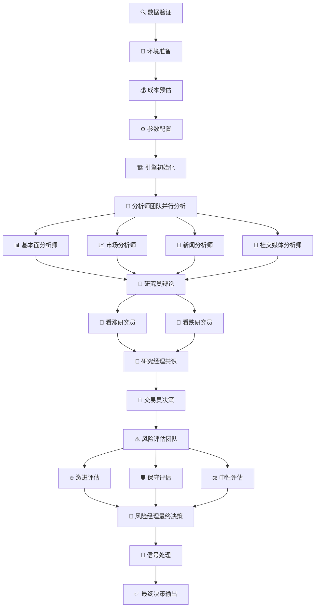

# 📊 TradingAgents 功能对比分析与开发指引

## 📍 **概述**

本文档对比分析了TradingAgents原始项目与当前微服务架构的功能差异，为后续开发提供明确的指引和优先级规划。

## 🎯 **项目现状总览**

### **架构对比**

| 维度 | 原TradingAgents | 微服务架构 | 完成度 |
|------|----------------|------------|--------|
| **核心架构** | 单体LangGraph应用 | 分布式微服务 | 🟢 100% |
| **智能体系统** | 完整多智能体协作 | 基础框架 | 🟡 20% |
| **数据处理** | 集成数据获取 | 统一数据服务 | 🟢 95% |
| **用户界面** | Streamlit Web界面 | 现代化Web界面 | 🟡 70% |
| **分析流程** | 完整工作流编排 | 基础分析引擎 | 🟡 30% |
| **报告系统** | 多格式导出 | 基础导出 | 🟡 40% |
| **监控运维** | 基础监控 | 企业级监控 | 🟢 80% |

### **技术栈对比**

| 组件 | 原TradingAgents | 微服务架构 | 优势 |
|------|----------------|------------|------|
| **应用框架** | LangGraph + Streamlit | FastAPI + Vue.js | 更现代化 |
| **数据存储** | 文件 + 简单缓存 | MongoDB + Redis | 更可靠 |
| **任务调度** | 同步执行 | Celery异步 | 更高效 |
| **服务发现** | 无 | Kubernetes原生 | 更可扩展 |
| **负载均衡** | 无 | Nginx + 智能路由 | 更稳定 |
| **容器化** | Docker基础 | K8s编排 | 更专业 |

## ✅ **已实现功能清单**

### **1. 微服务基础架构 (100%)**
```
✅ LLM Service (端口 8004)
   - 多模型支持 (DashScope, OpenAI, DeepSeek, Google)
   - 智能模型路由
   - 成本优化策略
   - 并发请求处理

✅ Data Service (端口 8003)
   - 统一数据获取接口
   - 多数据源支持 (Tushare, AKShare, BaoStock, FinnHub)
   - 智能缓存策略
   - 数据质量验证

✅ Memory Service (端口 8006)
   - ChromaDB向量存储
   - Embedding记忆系统
   - 语义搜索功能
   - 记忆管理API

✅ Task Scheduler (端口 8007)
   - Celery异步任务
   - 定时任务调度
   - 任务优先级管理
   - 失败重试机制

✅ Analysis Engine (端口 8005)
   - 基础分析框架
   - 并发分析支持
   - 负载均衡
   - 健康检查
```

### **2. 数据处理能力 (95%)**
```
✅ 多市场支持
   - 🇺🇸 美股 (YFinance, FinnHub)
   - 🇨🇳 A股 (Tushare, AKShare, BaoStock)
   - 🇭🇰 港股 (AKShare, YFinance)

✅ 数据类型覆盖
   - 股票基本信息
   - 历史价格数据
   - 基本面数据
   - 新闻和情绪数据
   - 技术指标数据

✅ 缓存和存储
   - Redis实时缓存
   - MongoDB持久化存储
   - 智能缓存策略
   - 数据版本管理
```

### **3. 基础用户界面 (70%)**
```
✅ Web管理界面
   - 股票分析功能
   - 配置管理系统
   - Token使用统计
   - 缓存管理工具

✅ 现代化前端
   - Vue.js + Element Plus
   - 响应式设计
   - 国际化支持
   - 组件化架构
```

## ❌ **缺失功能分析**

### **1. 完整智能体系统 (优先级: 🔴 最高)**

#### **原TradingAgents智能体架构**
```python
# 分析师团队 (Analysts Team)
├── 📊 基本面分析师 (fundamentals_analyst)
│   ├── 财务数据分析
│   ├── 估值模型计算
│   └── 基本面评分
├── 📈 市场分析师 (market_analyst)
│   ├── 技术指标分析
│   ├── 趋势识别
│   └── 价格预测
├── 📰 新闻分析师 (news_analyst)
│   ├── 新闻情绪分析
│   ├── 事件影响评估
│   └── 舆情监控
└── 💬 社交媒体分析师 (social_media_analyst)
    ├── 社交媒体情绪
    ├── 热度分析
    └── 影响力评估

# 研究员团队 (Research Team)
├── 🐂 看涨研究员 (bull_researcher)
│   ├── 积极因素挖掘
│   ├── 增长潜力分析
│   └── 乐观预期建模
└── 🐻 看跌研究员 (bear_researcher)
    ├── 风险因素识别
    ├── 下跌风险评估
    └── 悲观情景分析

# 管理层 (Management)
├── 👔 研究经理 (research_manager)
│   ├── 研究员观点整合
│   ├── 共识形成机制
│   └── 投资建议生成
└── 🎯 风险经理 (risk_manager)
    ├── 风险评估整合
    ├── 风险控制策略
    └── 最终决策审核

# 交易执行 (Trading)
└── 💼 交易员 (trader)
    ├── 交易策略制定
    ├── 仓位管理建议
    └── 执行时机判断

# 风险评估团队 (Risk Assessment)
├── 🔥 激进风险评估 (risky_debator)
├── 🛡️ 保守风险评估 (safe_debator)
└── ⚖️ 中性风险评估 (neutral_debator)
```

#### **微服务架构需要实现**
```python
# 智能体服务架构设计
Agent Service (端口 8008)
├── 智能体管理器 (AgentManager)
├── 协作编排器 (CollaborationOrchestrator)
├── 辩论引擎 (DebateEngine)
├── 共识算法 (ConsensusAlgorithm)
└── 决策聚合器 (DecisionAggregator)

# 实现优先级
1. 🔴 核心智能体实现 (2-3周)
2. 🔴 智能体协作机制 (2-3周)
3. 🟡 辩论和共识算法 (1-2周)
4. 🟡 决策聚合和输出 (1周)
```

### **2. 分析工作流引擎 (优先级: 🔴 最高)**

#### **原TradingAgents分析流程**


#### **微服务架构需要实现**
```python
# 工作流引擎设计
Workflow Engine (集成到Analysis Engine)
├── 流程定义器 (ProcessDefinition)
├── 任务调度器 (TaskScheduler)
├── 状态管理器 (StateManager)
├── 结果聚合器 (ResultAggregator)
└── 进度跟踪器 (ProgressTracker)

# 实现计划
1. 🔴 工作流引擎核心 (2周)
2. 🔴 智能体任务编排 (2周)
3. 🟡 状态管理和持久化 (1周)
4. 🟡 进度跟踪和监控 (1周)
```

### **3. 高级用户界面功能 (优先级: 🟡 中等)**

#### **缺失的Web界面功能**
```python
# 历史记录管理系统
📈 历史记录模块
├── 分析历史查询
├── 决策历史追踪
├── 性能回测分析
├── 策略效果统计
└── 历史数据导出

# 系统状态监控面板
🔧 系统状态模块
├── 服务健康监控
├── 性能指标展示
├── 资源使用统计
├── 错误日志查看
└── 系统配置管理

# 高级可视化图表
📊 可视化增强
├── 专业K线图
├── 技术指标图表
├── 基本面分析图
├── 风险分析雷达图
├── 投资组合分析
└── 相关性热力图
```

#### **实现优先级**
```python
1. 🟡 历史记录管理 (1-2周)
2. 🟡 系统监控面板 (1-2周)
3. 🟢 高级图表组件 (2-3周)
4. 🟢 交互式分析工具 (2-3周)
```

### **4. 报告生成和导出系统 (优先级: 🟡 中等)**

#### **原TradingAgents报告功能**
```python
# 报告类型
📄 报告系统
├── 股票分析报告
│   ├── 基本面分析章节
│   ├── 技术分析章节
│   ├── 风险评估章节
│   └── 投资建议章节
├── 投资组合报告
│   ├── 组合概况
│   ├── 风险分析
│   ├── 收益分析
│   └── 优化建议
├── 市场概况报告
│   ├── 市场趋势
│   ├── 板块分析
│   ├── 热点追踪
│   └── 风险提示
└── 自定义报告
    ├── 用户定制模板
    ├── 动态内容生成
    └── 个性化分析

# 导出格式
📤 导出功能
├── PDF (专业格式)
├── Word (可编辑)
├── Excel (数据分析)
├── PowerPoint (演示)
└── HTML (在线查看)
```

#### **微服务架构需要实现**
```python
# 报告服务设计
Report Service (端口 8009)
├── 报告模板引擎
├── 内容生成器
├── 格式转换器
├── 版本管理器
└── 分发系统

# 实现计划
1. 🟡 报告模板系统 (2周)
2. 🟡 内容生成引擎 (2周)
3. 🟢 多格式导出 (1-2周)
4. 🟢 报告管理系统 (1周)
```

### **5. 智能学习和优化系统 (优先级: 🟢 低)**

#### **原TradingAgents学习机制**
```python
# 学习系统
🧠 智能学习
├── 决策效果跟踪
│   ├── 预测准确率统计
│   ├── 投资收益跟踪
│   └── 风险控制效果
├── 策略优化
│   ├── 参数自动调优
│   ├── 模型权重优化
│   └── 决策规则改进
├── 用户行为学习
│   ├── 偏好识别
│   ├── 风险承受度
│   └── 决策模式分析
└── 市场适应性
    ├── 市场环境识别
    ├── 策略动态调整
    └── 新模式学习
```

#### **实现规划**
```python
# 学习服务设计
Learning Service (端口 8010)
├── 效果跟踪器
├── 策略优化器
├── 用户画像系统
└── 自适应引擎

# 实施时间线
1. 🟢 效果跟踪基础 (2-3周)
2. 🟢 策略优化算法 (3-4周)
3. 🟢 用户行为分析 (2-3周)
4. 🟢 自适应机制 (3-4周)
```

## 🚀 **开发路线图**

### **第一阶段: 核心智能体系统 (6-8周)**

#### **里程碑1: 智能体基础框架 (2-3周)**
```python
目标: 实现基础智能体架构
任务:
- [ ] Agent Service微服务搭建
- [ ] 基础智能体类实现
- [ ] 智能体注册和管理
- [ ] 基础通信机制

验收标准:
- 所有智能体类型可以创建和管理
- 智能体可以接收和处理任务
- 基础的消息传递机制工作正常
```

#### **里程碑2: 智能体协作机制 (2-3周)**
```python
目标: 实现智能体间协作
任务:
- [ ] 协作编排器实现
- [ ] 任务分发机制
- [ ] 结果聚合算法
- [ ] 状态同步机制

验收标准:
- 多个智能体可以协同工作
- 任务可以正确分发和执行
- 结果可以正确聚合
- 状态同步机制稳定
```

#### **里程碑3: 辩论和共识算法 (1-2周)**
```python
目标: 实现智能体辩论机制
任务:
- [ ] 辩论引擎实现
- [ ] 共识算法设计
- [ ] 冲突解决机制
- [ ] 决策质量评估

验收标准:
- 研究员可以进行有效辩论
- 共识算法能产生合理结果
- 冲突可以得到妥善解决
- 决策质量可以量化评估
```

#### **里程碑4: 工作流集成 (1周)**
```python
目标: 集成完整分析工作流
任务:
- [ ] 工作流引擎集成
- [ ] 端到端流程测试
- [ ] 性能优化
- [ ] 错误处理完善

验收标准:
- 完整分析流程可以正常运行
- 性能满足要求 (< 5分钟完成分析)
- 错误处理机制完善
- 结果质量达到预期
```

### **第二阶段: 用户体验增强 (4-6周)**

#### **里程碑5: 历史记录系统 (1-2周)**
```python
目标: 实现完整的历史记录管理
任务:
- [ ] 历史数据模型设计
- [ ] 查询和检索接口
- [ ] Web界面实现
- [ ] 数据导出功能

验收标准:
- 所有分析历史可以查询
- 支持多维度筛选和排序
- 界面友好易用
- 支持数据导出
```

#### **里程碑6: 系统监控面板 (1-2周)**
```python
目标: 实现系统状态监控
任务:
- [ ] 监控指标收集
- [ ] 实时状态展示
- [ ] 告警机制实现
- [ ] 性能分析工具

验收标准:
- 系统状态实时可见
- 关键指标准确监控
- 异常情况及时告警
- 性能瓶颈可以识别
```

#### **里程碑7: 高级可视化 (2-3周)**
```python
目标: 实现专业金融图表
任务:
- [ ] 专业图表组件开发
- [ ] 交互式分析工具
- [ ] 自定义配置功能
- [ ] 移动端适配

验收标准:
- 图表专业美观
- 交互体验流畅
- 配置灵活方便
- 移动端体验良好
```

### **第三阶段: 高级功能完善 (4-6周)**

#### **里程碑8: 报告生成系统 (2-3周)**
```python
目标: 实现专业报告生成
任务:
- [ ] 报告模板系统
- [ ] 内容生成引擎
- [ ] 多格式导出
- [ ] 报告管理功能

验收标准:
- 报告内容专业完整
- 支持多种导出格式
- 生成速度满足要求
- 报告管理功能完善
```

#### **里程碑9: 智能学习系统 (2-3周)**
```python
目标: 实现智能学习和优化
任务:
- [ ] 效果跟踪系统
- [ ] 策略优化算法
- [ ] 用户行为分析
- [ ] 自适应机制

验收标准:
- 决策效果可以跟踪
- 策略可以自动优化
- 用户偏好可以学习
- 系统具备自适应能力
```

## 📊 **资源需求评估**

### **人力资源**
```python
# 开发团队配置建议
核心开发团队 (4-6人)
├── 🏗️ 架构师 (1人)
│   ├── 微服务架构设计
│   ├── 技术选型决策
│   └── 代码质量把控
├── 🤖 AI工程师 (2人)
│   ├── 智能体系统开发
│   ├── LLM集成优化
│   └── 算法实现
├── 🌐 前端工程师 (1人)
│   ├── Vue.js界面开发
│   ├── 可视化组件
│   └── 用户体验优化
├── 🔧 后端工程师 (1人)
│   ├── 微服务开发
│   ├── API设计实现
│   └── 数据库优化
└── 🧪 测试工程师 (1人)
    ├── 自动化测试
    ├── 性能测试
    └── 质量保证
```

### **时间规划**
```python
# 总体时间线
项目总周期: 14-20周 (3.5-5个月)

阶段一: 核心智能体系统 (6-8周)
├── 智能体框架: 2-3周
├── 协作机制: 2-3周
├── 辩论算法: 1-2周
└── 工作流集成: 1周

阶段二: 用户体验增强 (4-6周)
├── 历史记录: 1-2周
├── 系统监控: 1-2周
└── 高级可视化: 2-3周

阶段三: 高级功能完善 (4-6周)
├── 报告系统: 2-3周
└── 学习系统: 2-3周
```

### **技术风险评估**
```python
# 风险等级和应对策略
🔴 高风险
├── 智能体协作复杂度
│   ├── 风险: 协作机制设计复杂
│   └── 应对: 分阶段实现，充分测试
└── LLM调用成本控制
    ├── 风险: 成本超出预算
    └── 应对: 智能缓存，模型优化

🟡 中风险
├── 性能优化挑战
│   ├── 风险: 复杂分析流程性能
│   └── 应对: 并发优化，缓存策略
└── 数据一致性保证
    ├── 风险: 分布式数据一致性
    └── 应对: 事务管理，状态同步

🟢 低风险
├── 前端界面开发
│   ├── 风险: 界面复杂度
│   └── 应对: 组件化开发
└── 报告生成功能
    ├── 风险: 格式兼容性
    └── 应对: 标准化模板
```

## 🎯 **成功标准定义**

### **功能完整性**
- ✅ 所有原TradingAgents核心功能100%复现
- ✅ 微服务架构优势充分发挥
- ✅ 用户体验显著提升

### **性能指标**
- ✅ 分析完成时间 < 5分钟
- ✅ 系统可用性 > 99.9%
- ✅ 并发用户支持 > 100

### **质量标准**
- ✅ 代码覆盖率 > 80%
- ✅ 自动化测试覆盖所有核心功能
- ✅ 文档完整性 > 90%

## 📋 **详细实施计划**

### **阶段一详细任务分解**

#### **智能体基础框架实现**
```python
# Week 1-2: Agent Service基础架构
backend/agent-service/
├── app/
│   ├── main.py                 # FastAPI应用入口
│   ├── agents/                 # 智能体实现
│   │   ├── base_agent.py       # 基础智能体类
│   │   ├── analysts/           # 分析师智能体
│   │   │   ├── fundamentals_analyst.py
│   │   │   ├── market_analyst.py
│   │   │   ├── news_analyst.py
│   │   │   └── social_media_analyst.py
│   │   ├── researchers/        # 研究员智能体
│   │   │   ├── bull_researcher.py
│   │   │   └── bear_researcher.py
│   │   ├── managers/           # 管理层智能体
│   │   │   ├── research_manager.py
│   │   │   └── risk_manager.py
│   │   ├── traders/            # 交易员智能体
│   │   │   └── trader.py
│   │   └── risk_assessors/     # 风险评估智能体
│   │       ├── risky_debator.py
│   │       ├── safe_debator.py
│   │       └── neutral_debator.py
│   ├── orchestration/          # 编排系统
│   │   ├── agent_manager.py    # 智能体管理器
│   │   ├── collaboration_engine.py # 协作引擎
│   │   ├── debate_engine.py    # 辩论引擎
│   │   └── consensus_algorithm.py # 共识算法
│   ├── models/                 # 数据模型
│   │   ├── agent_models.py     # 智能体模型
│   │   ├── task_models.py      # 任务模型
│   │   └── result_models.py    # 结果模型
│   └── utils/                  # 工具函数
│       ├── prompt_manager.py   # 提示词管理
│       ├── state_manager.py    # 状态管理
│       └── message_router.py   # 消息路由
├── tests/                      # 测试文件
├── Dockerfile                  # 容器化配置
└── requirements.txt            # 依赖管理

# 关键实现任务
1. [ ] 基础智能体抽象类设计
2. [ ] 智能体注册和发现机制
3. [ ] 任务分发和执行框架
4. [ ] 状态管理和持久化
5. [ ] 消息传递和通信协议
```

#### **工作流引擎集成**
```python
# Week 3-4: Workflow Engine增强
backend/analysis-engine/app/workflow/
├── workflow_engine.py          # 工作流引擎核心
├── process_definitions/        # 流程定义
│   ├── stock_analysis_flow.py  # 股票分析流程
│   ├── portfolio_analysis_flow.py # 组合分析流程
│   └── risk_assessment_flow.py # 风险评估流程
├── task_scheduler.py           # 任务调度器
├── state_machine.py            # 状态机
├── result_aggregator.py        # 结果聚合器
└── progress_tracker.py         # 进度跟踪器

# 核心工作流定义
class StockAnalysisWorkflow:
    """股票分析工作流"""

    def __init__(self):
        self.stages = [
            "data_validation",      # 数据验证
            "environment_setup",    # 环境准备
            "cost_estimation",      # 成本预估
            "parameter_config",     # 参数配置
            "engine_initialization", # 引擎初始化
            "analyst_team_analysis", # 分析师团队分析
            "researcher_debate",    # 研究员辩论
            "manager_consensus",    # 经理共识
            "trader_decision",      # 交易员决策
            "risk_assessment",      # 风险评估
            "final_decision",       # 最终决策
            "signal_processing",    # 信号处理
            "result_output"         # 结果输出
        ]

    async def execute(self, symbol: str, analysis_date: str) -> Dict[str, Any]:
        """执行完整分析流程"""
        context = AnalysisContext(symbol=symbol, date=analysis_date)

        for stage in self.stages:
            result = await self.execute_stage(stage, context)
            context.update_stage_result(stage, result)

        return context.get_final_result()
```

### **阶段二详细任务分解**

#### **历史记录管理系统**
```python
# Week 5-6: History Management Service
backend/history-service/
├── app/
│   ├── main.py                 # 服务入口
│   ├── models/                 # 数据模型
│   │   ├── analysis_history.py # 分析历史模型
│   │   ├── decision_history.py # 决策历史模型
│   │   └── performance_history.py # 性能历史模型
│   ├── services/               # 业务服务
│   │   ├── history_manager.py  # 历史管理器
│   │   ├── query_engine.py     # 查询引擎
│   │   └── analytics_engine.py # 分析引擎
│   ├── api/                    # API接口
│   │   ├── history_api.py      # 历史记录API
│   │   ├── analytics_api.py    # 分析统计API
│   │   └── export_api.py       # 导出API
│   └── utils/                  # 工具函数
│       ├── data_aggregator.py  # 数据聚合器
│       └── export_formatter.py # 导出格式化器

# 前端历史记录界面
frontend/src/views/history/
├── AnalysisHistory.vue         # 分析历史页面
├── DecisionHistory.vue         # 决策历史页面
├── PerformanceAnalytics.vue    # 性能分析页面
└── components/                 # 历史记录组件
    ├── HistoryTable.vue        # 历史记录表格
    ├── HistoryChart.vue        # 历史趋势图表
    ├── FilterPanel.vue         # 筛选面板
    └── ExportDialog.vue        # 导出对话框
```

#### **系统监控面板**
```python
# Week 7-8: System Monitoring Dashboard
backend/monitoring-service/
├── app/
│   ├── main.py                 # 监控服务入口
│   ├── collectors/             # 指标收集器
│   │   ├── service_collector.py # 服务指标收集
│   │   ├── performance_collector.py # 性能指标收集
│   │   └── business_collector.py # 业务指标收集
│   ├── analyzers/              # 分析器
│   │   ├── anomaly_detector.py # 异常检测
│   │   ├── trend_analyzer.py   # 趋势分析
│   │   └── alert_manager.py    # 告警管理
│   ├── dashboards/             # 仪表盘
│   │   ├── system_dashboard.py # 系统仪表盘
│   │   ├── business_dashboard.py # 业务仪表盘
│   │   └── performance_dashboard.py # 性能仪表盘
│   └── api/                    # 监控API
│       ├── metrics_api.py      # 指标API
│       ├── alerts_api.py       # 告警API
│       └── dashboard_api.py    # 仪表盘API

# 监控指标定义
class SystemMetrics:
    """系统监控指标"""

    service_metrics = [
        "service_health",           # 服务健康状态
        "response_time",           # 响应时间
        "request_rate",            # 请求速率
        "error_rate",              # 错误率
        "cpu_usage",               # CPU使用率
        "memory_usage",            # 内存使用率
        "disk_usage",              # 磁盘使用率
        "network_io"               # 网络IO
    ]

    business_metrics = [
        "analysis_success_rate",   # 分析成功率
        "average_analysis_time",   # 平均分析时间
        "daily_analysis_count",    # 日分析次数
        "user_satisfaction",       # 用户满意度
        "cost_per_analysis",       # 单次分析成本
        "llm_token_usage",         # LLM Token使用量
        "cache_hit_rate",          # 缓存命中率
        "data_freshness"           # 数据新鲜度
    ]
```

### **阶段三详细任务分解**

#### **报告生成系统**
```python
# Week 9-11: Report Generation Service
backend/report-service/
├── app/
│   ├── main.py                 # 报告服务入口
│   ├── templates/              # 报告模板
│   │   ├── stock_analysis_template.py # 股票分析模板
│   │   ├── portfolio_template.py # 投资组合模板
│   │   ├── risk_assessment_template.py # 风险评估模板
│   │   └── market_overview_template.py # 市场概况模板
│   ├── generators/             # 内容生成器
│   │   ├── content_generator.py # 内容生成器
│   │   ├── chart_generator.py  # 图表生成器
│   │   └── summary_generator.py # 摘要生成器
│   ├── exporters/              # 导出器
│   │   ├── pdf_exporter.py     # PDF导出器
│   │   ├── word_exporter.py    # Word导出器
│   │   ├── excel_exporter.py   # Excel导出器
│   │   └── html_exporter.py    # HTML导出器
│   ├── managers/               # 管理器
│   │   ├── template_manager.py # 模板管理器
│   │   ├── version_manager.py  # 版本管理器
│   │   └── distribution_manager.py # 分发管理器
│   └── api/                    # 报告API
│       ├── generation_api.py   # 生成API
│       ├── template_api.py     # 模板API
│       └── export_api.py       # 导出API

# 报告模板示例
class StockAnalysisReportTemplate:
    """股票分析报告模板"""

    def __init__(self):
        self.sections = [
            {
                "title": "执行摘要",
                "content_type": "summary",
                "data_sources": ["final_decision", "key_metrics"]
            },
            {
                "title": "股票基本信息",
                "content_type": "basic_info",
                "data_sources": ["stock_info", "market_data"]
            },
            {
                "title": "基本面分析",
                "content_type": "fundamental_analysis",
                "data_sources": ["fundamentals_analyst_result"]
            },
            {
                "title": "技术分析",
                "content_type": "technical_analysis",
                "data_sources": ["market_analyst_result"]
            },
            {
                "title": "新闻和情绪分析",
                "content_type": "sentiment_analysis",
                "data_sources": ["news_analyst_result", "social_media_analyst_result"]
            },
            {
                "title": "投资建议",
                "content_type": "investment_recommendation",
                "data_sources": ["trader_decision", "research_manager_consensus"]
            },
            {
                "title": "风险评估",
                "content_type": "risk_assessment",
                "data_sources": ["risk_manager_decision", "risk_assessors_results"]
            },
            {
                "title": "附录",
                "content_type": "appendix",
                "data_sources": ["raw_data", "detailed_calculations"]
            }
        ]
```

## 🔧 **技术实施指南**

### **微服务通信协议**
```python
# 服务间通信标准
class ServiceCommunication:
    """微服务通信协议"""

    # HTTP API调用
    async def call_service(self, service_name: str, endpoint: str, data: Dict) -> Dict:
        """标准服务调用"""
        url = f"http://{service_name}:8000{endpoint}"
        async with aiohttp.ClientSession() as session:
            async with session.post(url, json=data) as response:
                return await response.json()

    # 消息队列通信
    async def publish_message(self, topic: str, message: Dict):
        """发布消息到队列"""
        await self.message_broker.publish(topic, message)

    # 事件驱动通信
    async def emit_event(self, event_type: str, event_data: Dict):
        """发出事件"""
        event = {
            "type": event_type,
            "timestamp": datetime.now().isoformat(),
            "data": event_data
        }
        await self.event_bus.emit(event)
```

### **数据一致性保证**
```python
# 分布式事务管理
class DistributedTransaction:
    """分布式事务管理器"""

    def __init__(self):
        self.transaction_log = []
        self.compensation_actions = []

    async def execute_saga(self, steps: List[TransactionStep]):
        """执行Saga模式事务"""
        completed_steps = []

        try:
            for step in steps:
                result = await step.execute()
                completed_steps.append(step)
                self.transaction_log.append({
                    "step": step.name,
                    "status": "completed",
                    "result": result
                })

        except Exception as e:
            # 执行补偿操作
            for step in reversed(completed_steps):
                await step.compensate()

            raise TransactionFailedException(f"事务失败: {e}")
```

### **性能优化策略**
```python
# 性能优化配置
class PerformanceOptimization:
    """性能优化策略"""

    # 缓存策略
    cache_config = {
        "stock_data": {"ttl": 300, "max_size": 1000},      # 5分钟
        "analysis_results": {"ttl": 1800, "max_size": 500}, # 30分钟
        "llm_responses": {"ttl": 3600, "max_size": 200}     # 1小时
    }

    # 并发控制
    concurrency_config = {
        "max_concurrent_analyses": 10,
        "max_llm_requests_per_second": 5,
        "max_data_requests_per_minute": 100
    }

    # 资源限制
    resource_limits = {
        "memory_per_analysis": "2GB",
        "cpu_per_analysis": "1 core",
        "analysis_timeout": "300 seconds"
    }
```

## 📈 **质量保证计划**

### **测试策略**
```python
# 测试金字塔
测试层次:
├── 单元测试 (70%)
│   ├── 智能体逻辑测试
│   ├── 工作流引擎测试
│   ├── 数据处理测试
│   └── API接口测试
├── 集成测试 (20%)
│   ├── 服务间通信测试
│   ├── 数据库集成测试
│   ├── 外部API集成测试
│   └── 端到端流程测试
└── 系统测试 (10%)
    ├── 性能测试
    ├── 压力测试
    ├── 安全测试
    └── 用户验收测试
```

### **代码质量标准**
```python
# 代码质量检查
quality_gates = {
    "code_coverage": ">= 80%",
    "complexity_score": "<= 10",
    "duplication_rate": "<= 3%",
    "security_vulnerabilities": "0",
    "performance_regression": "0%"
}

# 代码审查清单
code_review_checklist = [
    "[ ] 代码符合项目编码规范",
    "[ ] 单元测试覆盖率达标",
    "[ ] 文档更新完整",
    "[ ] 性能影响评估",
    "[ ] 安全风险评估",
    "[ ] 错误处理完善",
    "[ ] 日志记录充分",
    "[ ] 配置管理规范"
]
```

## 🎯 **项目管理建议**

### **敏捷开发流程**
```python
# Sprint规划 (2周一个Sprint)
Sprint_1_2: "智能体基础框架"
Sprint_3_4: "协作机制和工作流"
Sprint_5_6: "历史记录和监控"
Sprint_7_8: "可视化和用户体验"
Sprint_9_10: "报告生成系统"
Sprint_11_12: "学习系统和优化"

# 每日站会关注点
daily_standup_focus = [
    "昨天完成了什么?",
    "今天计划做什么?",
    "遇到什么阻碍?",
    "需要什么帮助?",
    "风险和依赖关系?"
]
```

### **风险管控措施**
```python
# 风险应对策略
risk_mitigation = {
    "技术风险": {
        "智能体协作复杂度": "分阶段实现，充分原型验证",
        "性能瓶颈": "早期性能测试，持续优化",
        "LLM成本控制": "智能缓存，模型选择优化"
    },
    "进度风险": {
        "需求变更": "敏捷开发，快速迭代",
        "技术难题": "技术预研，专家咨询",
        "资源不足": "优先级管理，外部支持"
    },
    "质量风险": {
        "功能缺陷": "自动化测试，代码审查",
        "性能问题": "性能监控，压力测试",
        "安全漏洞": "安全扫描，渗透测试"
    }
}
```

这个详细的开发指引为TradingAgents微服务化提供了完整的实施路线图，确保项目能够高质量、按时交付！🚀
